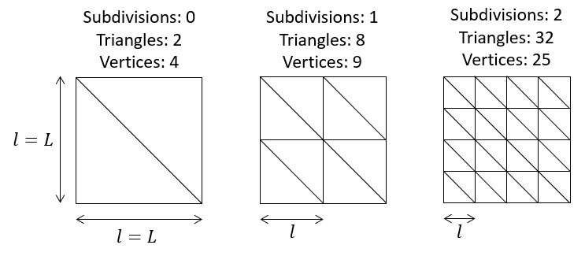
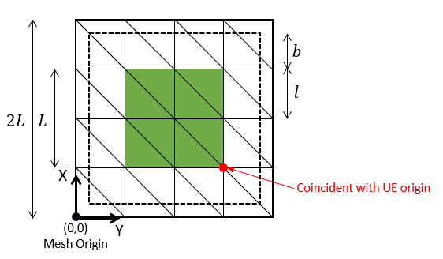

# AutoSceneGen Actors

This page describes all of the primary actors provided by this plugin that you will be interacting with.

Quick Links:
- [Home Page](https://github.com/tsender/AutomaticSceneGeneration)
- Components
- Sensors

## AutoSceneGenWorker

This is the main actor controlling everything within the simulation and is the server that the AutoSceneGenClient node communicates with. This actor is responsible for processing the RunScenario requests, creating the specified scene, and monitoring the navigation task.

Every level must have one of these actors in the World Outliner to take advantage of the features provided by this plugin. While most of the settings in the details panel under the category "AutoSceneGenVehicle" are overwritten from the RunScenario request, there are a few that should be modified prior to pressing Play:
* `Worker ID`: The ID associated with this worker. Used in communication with the AutoSceneGenClient. All ROS topics related to this plugin will have the prefix `/asg_workerX/` where "X" is the worker ID.
* `Landscape Material`: The material/texture that will be applied to the AutoSceneGenLandscape actor.
* `Vehicle Start Location`: The starting location for the vehicle. Make sure this location is within the landscape bounds and is just above the landscape (a Z value of 50 cm should be fine). This ensures the vehicle starts on the default landscape.
* `Auto Scene Gen Client Name`: The name of the ROS AutoSceneGenClient node.
Almost all of the other settings are used right after you press Play, and then get reset from the ROS interface.

### Additional Requirements
* A directional light set to `Moveable` must exist in the World Outline so that we can control the sun position.
* Uncheck the `EnableWorldBoundsCheck` in the World Settings. This will allow the AutoSceneGenWorker to teleport the AutoSceneGenVehicle when the vehicle needs to be reset.

### ROS Objects

Lists any publishers, subscribers, clients, and/or services monitored by this actor. All instances of "asg_client" in the below topic names get replaced with the actual name of the AutoSceneGenClient node.

**Publishers:**
- Worker Status Pub:
  - Topic: `/asg_workerX/status`
  - Type: `auto_scene_gen_msgs/StatusCode`
  - Description: Publishes the worker's status
- Vehicle Destination Pub
  - Topic: `/asg_workerX/nav/destination`
  - Type: `geometry_msgs/Pose`
  - Description: Publishes the goal location for the vehicle

**Subscribers:**
- AutoSceneGenClient Status Sub:
  - Topic: `/asg_client/status`
  - Type: `auto_scene_gen_msgs/StatusCode`
  - Description: Subscribes to the AutoSceneGenClient node's status
 
**Clients:**
- Analyze Scenario Client:
  - Topic: `/asg_client/services/analyze_scenario`
  - Type: `auto_scene_gen_msgs/AnalyzeScenario`
  - Description: Sends information about the vehicle's trajectory to the AutoSceneGenClient for processing
 
**Services:**
- Run Scenario Service:
  - Topic: `/asg_workerX/services/run_scenario`
  - Type: `auto_scene_gen_msgs/RunScenario`
  - Description: Service for running various navigation scenarios (includes creating the scene, monitoring the vehicle's progress, terminating the simulation, sending the vehicle's trajectory info to the AutoSceneGenCLient, and awaiting the next scenario request)

## AutoSceneGenLandscape

This is a custom landscape actor that allows you to modify its height map at runtime (unlike the landscape actor provided by UE which only allows manual modifications through the interactive landscape menu). Having this capability is incredibly important for testing off-road vehicles in diverse environments. While we do provide a number of C++ sculpting brushes available for modifying the landscape's elevation (similar to the brushes with UE's landscape actor), these features are still experimental and not yet accessible via the ROS interface. The landscape below is a demo landscape showing off some of these features. This actor currently is only fully tested for creating flat landscapes (in the future we will test/enable the remaining features).

### The Landscape Mesh
The landscape is a square mesh subdivided into triangles. The overall mesh consists of a nominal landscape and an optional border. The nominal landscape is the region in which the user can apply the various sculpting brushes to shape its mesh. The border controls how much padding is placed around the nominal landscape and it is solely a convenience feature. If the user only wants to control a LxL sized landscape, but wants the landscape to appear as if it extends in all directions (or at least far enough that the vehicle wouldn't know the landscape has a finite size), then applying a border prevents the user from having to manually account for the border when modifying or interacting with the landscape.

There are a few primary parameters that control the base (flat) landscape (accessible through the AutoSceneGenWorker and the ROS interface):
- Nominal Size: The size of the nominal landscape.
- Subdivisions: The number of times the triangles in the nominal landscape mesh should be subdivided. Must be a nonnegaive integer.
- Border: The minimum allowed amount of padding for the border.

The figure below illustrates how the AutoSceneGenLandscape actor creates a landscape mesh (without any border) using the nominal size $L$ and subdivisions $S$. The formulas for determining how many triangles $T$ and vertices $V$ that will be in the mesh are $T = 2^{2S+1}$  and $V = (S+2)^2$. The vertex spacing $l$ is given by the formula $l = L/(2^S)$, and this spacing holds for *all* vertices in the entire mesh.

The figure below illustrates the placement of the mesh as well as how the border affects the mesh. Using the same notation as above, in this example we have $S=1$, $l = L/2$, and $b < l$. The green square indicates the nominal landscape part of the mesh; the lower left corner of the nominal landscape always lies ot the origin (0,0) in UE. The dashed square indicates the size of the nominal landscape with the border using the requested padding. Due to the vertex spacing $s$, we set the border padding to the next greatest multiple of $l$, creating a slightly larger mesh. The actual border will consist of $\text{ceil}(b/l)$ vertices in each direction as shown by the largest square with the solid border.

### Additional Requirements
- Every level must have one of these actors in it, as the AutoSceneGenWorker will use it to create the desired scene.
- Go to World Settings --> World --> Navigation System Config --> Disable `NullNavSysConfig`.
- Go to World Settings --> Lightmass --> Check `ForceNoPrecomputedLighting`.

## AutoSceneGenVehicle

This is the base vehicle actor class. This class comes with a custom `PIDDriveByWireComponent` to allow you to control it externally via ROS, and you can attach any number of our provided sensors to the vehicle. To create your vehicle model, follow these steps:
1. Make a Blueprint class that inherits from `AutoSceneGenVehicle`.
2. Click on the MeshComponent.
   - Under "Animation", provide the `Animation Mode` and `Anim Class`.
   - Under "Mesh", provide the `Skeletal Mesh`.
   - Under "Materials", make sure the skeletal mesh materials appear.
3. Go to the physics asset for the skeletal mesh. Click on each component in the Skeleton Tree and under "Collision", check the box `Simulation Generates Hit Events`.
4. Go to the Class Defaults for the BP actor
   - Adjust the `Linear Motion Threshold` value as desired. This value is used to determine if the vehicle is stuck or idling.
   - Set the vehicle name as desired. All ROS topics pertaining to the vehicle will have the prefix `/asg_workerX/vehicle_name/`. If no worker is present, then the prefix will just be `/vehicle/`.
6. Click on the `DriveByWireComponent`
   - Under "PID Drive By Wire", make sure `Manual Drive` is unchecked, and set the desired Kp and Kd values for the throttle PID controller.
7. Attach sensors to the vehicle (see below for types of provided sensors)

### ROS Objects

Lists any publishers, subscribers, clients, and/or services monitored by this actor. All instances of "vehicle_name" in the below topic names get replaced with the actual vehicle name as set in the Blueprint.

**Publishers:**
- Vehicle Status Pub:
  - Topic: `/asg_workerX/vehicle_name/status`
  - Type: `auto_scene_gen_msgs/StatusCode`
  - Description: Publishes the vehicle's status

## StructuralSceneActor

Structural scene acotrs (SSAs) are static structural elements that are part of the landscape (e.g., trees, bushes, rocks, etc.). This is a C++ class that you will create Blueprint child classes from. The configurable parameters are under the "Structural Scene Actor" tab in the details panel:
- `Static Mesh Component`: This is where you provide the static mesh component for the actor.
- `Traversable Height Threshold`: If the actor is less than this height, then it will be considered traversable and the vehicle mesh will not collide with it (i.e, they will "pass through" each other). This height is also used by the traversability segmenation camera.
- `Always Traversable`: Indicates if the actor will always be traversable. If so, then the vehicle mesh will never collide with this mesh.
- `Semantic Segmentation Color `: The color these objects will appear in semantic segmentation images.
