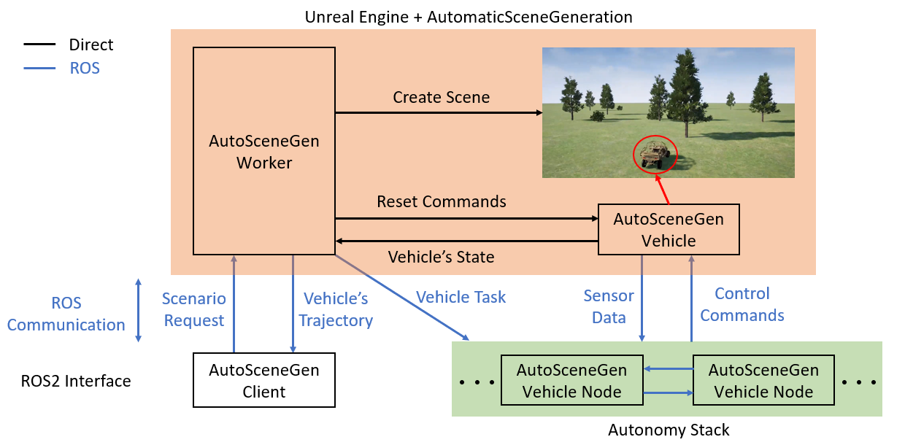

# AutomaticSceneGeneration Plugin for Unreal Engine 4

Table of Contents
- [Description](#description)
- [The AutoSceneGen Ecosystem and Dependencies](#the-autoscenegen-ecosystem-and-dependencies)
- [Installation](#installation)
- [Overview](#overview)

## Description
The purpose of this plugin is to support the development, validation, and testing of off-road autonomous vehicles (AVs). One of the primary knowledge gaps pertaining to off-road AV evaluation and testing is in the ability to *quickly and automatically* test an AV system in *arbitrary and diverse* simulated environments. While there exist numerous simulator packages designed for the development and testing of AVs in urban environments, most notably the [CARLA](https://carla.org/) simulator, there are very few high-fidelity open-source tools designed for testing AVs in natural, unstructured off-road environments. Consequently, we are developing a plugin for Unreal Engine specifically for this purpose. Our plugin allows for an external ROS2 client to test a virtual vehicle in any scenario (suppported by our custom scenario description protocol) across as many UE4 editors as your computational resources can support. We also provide an external ROS2 interface to interact with this plugin.

*Automation* is an integral component for efficiently conducting navigation scenarios one after the other. This process includes tearing down the previous scene, creating the new one, resetting the internal state of the vehicle's processing nodes, and signalling to the vehicle processing nodes when it's okay to run. All of these functional requirements needed to perform automatic scene creation and vehicle testing are embedded into this platform, hence the name "Automatic Scene Generation".

Moving forward, we will often refer to the UE plugin by the abbreviated name "AutoSceneGen". This plugin currently only supports UE4.

### A Note from the Author 
My name is Ted Sender, I am a PhD candidate at the University of Michigan, and I am developing this platform as part of my PhD research project. This platform is still in its infancy and will be under active development as I continue my research.

I am aware that some features you may wish to have (e.g. a larger sensor suite, a weather system, controlling the 3D terrain elevation, etc.) have not yet been added to this platform. Some improvements are a work in progress and/or will be added in the near future as I continue my research, some might get added in my free time, and others may just be a stretch goal. My goal is that together, we can improve the capabilities of this platform and the state-of-the-art in testing off-road AVs.

### Citation

If you use our work in an academic context, we would greatly appreciate it if you used the following citation:

TODO

## The AutoSceneGen Ecosystem and Dependencies

The entire ecosystem consists of a few plugins for Unreal Engine and a few ROS packages.

**Supported Systems:**
- Unreal Engine 4.23-4.27
  - This repo was written and tested using UE4.26 on Windows 10, but it should work on the listed versions.
- ROS2 Foxy+
  - This repo was written and tested with ROS2 Foxy on Ubuntu 20.04, but it should work on Foxy and up.

**Required Software Libraries:**
1. AutomaticSceneGeneration Plugin for UE4 (this repo)
2. [ROSIntegration](https://github.com/tsender/ROSIntegration/tree/feature/specify_ros_version): A plugin for UE4 that enables ROS communication. You will need to use the `feature/specify_ros_version` branch of @tsender's fork.
3. [rosbridge_suite](https://github.com/tsender/rosbridge_suite/tree/main): Required by the ROSIntegration plugin. Use the `main` branch on @tsender's fork because the authors of `rosbridge_suite` have not yet accepted accepted the PR https://github.com/RobotWebTools/rosbridge_suite/pull/824 (please feel free to contribute to the PR in any way).
4. auto_scene_gen: A ROS2 interface that provides the necessary tools to interact with this plugin.
   - Since this repo is the minimalistic ROS2 interface, it is often more convenient to add the ament packages in the `auto_scene_gen_ros2` repo to the repo you are developing.

## Installation

**Installing the UE4 Plugins**
1. Install a supported version of Unreal Engine 4 and create a code project (let's refer to this project as "MyProject").
2. Download the `ROSIntegration` and `AutomaticSceneGeneration` plugins using the links above (making sure you download the specified branches). Copy these plugins into your `MyProject/Plugins/` folder.
3. Open up your UE4 project and let the editor build the plugins (they will build automatically the first time you open the project).
4. Once everything builds and the project opens, verify the plugins are active by going to Edit -> Plugins. If they are for some reason inactive, then activate them and restart the editor.

**Installing the ROS2 Packages**

1. Install a supported ROS2 version OR use our provided dockerfiles in Ubuntu with all the needed dependencies. If using docker, then you can download our docker image with the tag `tsender/tensorflow:gpu-focal-foxy` (you may need to login to your docker account from the command line) or you can modify the [original docker image](https://github.com/tsender/dockerfiles/blob/main/tensorflow_foxy/Dockerfile) and build it.
2. Let's put all of our code in a common folder: `mkdir ~/auto_scene_gen_ws`
3. Let's clone and build rosbridge_suite
   ```
   cd ~/auto_scene_gen_ws/
   mkdir rosbridge_suite
   cd rosbridge_suite/
   git clone https://github.com/tsender/rosbridge_suite.git src
   source /opt/ros/foxy/setup.bash
   colcon build
   ```
3. Let's clone and build the `auto_scene_gen` repo. Rplace this repo with your primary development repo, so long as contains the `auto_scene_gen` packages.
   ```
   cd ~/auto_scene_gen_ws/
   source rosbridge_suite/install/setup.bash # rosbridge_suite is our underlay
   mkdir auto_scene_gen
   cd auto_scene_gen
   git clone https://github.com/tsender/auto_scene_gen.git src
   colcon build
   source install/setup.bash # This sources the overlay
   ```
   In all new terminals you open, make sure to source the overlay:
   ```
   source ~/auto_scene_gen_ws/auto_scene_gen/install/setup.bash
   ```

**Initial UE4 Setup**
1. Open your UE4 project.
2. In the Content Browser area, go to View Options and check "Show Plugin Content".
3. Go to Project Settings -> Maps and Modes, then set the GameInstance object to `ROSIntgrationGameInstance`. Save your settings.
4. Make sure the Output Log is visible in your display by clicking Window -> Developer Tools -> Output Log (the UE4 plugins make heavy use of logging).
5. Add a `ROSBridgeParamOverride` actor to the level. Click on this actor in the World Outline. Under the Details display, Sst the ROSVersion to 2, and adjust the `ROSBridgeServerHost` and `ROSBridgeServerPort` according to your setup. Save the level.
8. Open a terminal in your Ubuntu computer and launch the rosbridge TCP node
   ```
   ros2 launch rosbridge_server rosbridge_tcp_launch.xml bson_only_mode:=True
   ```
   Or feel free to create another version of this launch file if you have other needs.
7. Press Play in your UE4 project, and you should see some log lines indicating that the game connected to rosbridge. You should also see a few lines printed to the rosbridge launch terminal indicating the client subscribed to a few ROS topics with a prefix `/unreal_ros/`. See the `ROSintegration` README if you have issues.

## Overview

### Typical Workflow



The diagram above shows the typical workflow for interacting with the platform. There are three main components: Unreal Engine (which includes this plugin), the autonomy stack under test, and an external client. The platform is configured to work following a server-client model, with the AutoSceneGenWorker as the server and the AutoSceneGenClient as the client. The general process is as follows:
1. The AutoSceneGenClient sends a `RunScenario` request to the AutoSceneGenWorker describing all of the scenario's parameters (scene description and mavigation task).
2. The AutoSceneGenWorker processes the `RunScenario` request, creates the desired scene, places the vehicle at the desired starting location and orientation, and relays the goal location to the AutoSceneGenVehicleNodes.
3. The autonomy stack, consisting of AutoSceneGenVehicleNodes, then process exchanges sensor data and control commands to control the vehicle to reach the goal location.
4. Once the AutoSceneGenVehicle receives its first control command, the AutoSceneGenWorker continuously monitors the vehicle's performance. If the vehicle succeeds or fails (see below for how we define failure), then the worker will reset the vehicle and send a `AnalyzeScenario` request to the client containing information about the vehicle's trajectory and performance.
5. The client will process the `AnalyzeScenario` request and when ready, it will create and submit a new `RunScenario` request describing the next navigation task to test. This process repeats until the client is done running tests.

### AutoSceneGenWorker Actor

This is the main actor controlling everything within the simulation and is the server that the AutoSceneGen client node communicates with. This actor is responsible for processing the RunScenario requests, creating the specified scene, and monitoring the navigation task.

Every level must have one of these actors in the World Outliner to take advantage of the features provided by this plugin. While most of the settings in the details panel under the category "AutoSceneGenVehicle" are overwritten from the RunScenario request, there are a few that should be modified prior to pressing Play:
* `Worker ID`: The ID associated with this worker. Used in communication with the AutoSceneGenClient. All ROS topics related to this plugin will have the prefix `/asg_workerX/` where "X" is the worker ID.
* `Landscape Material`: The material/texture that will be applied to the AutoSceneGenLandscape actor.
* `Vehicle Start Location`: The starting location for the vehicle. Make sure this location is within the landscape bounds and is just above the landscape (a Z value of 50 cm should be fine). This ensures the vehicle starts on the default landscape.
* `Auto Scene Gen Client Name`: The name of the ROS AutoSceneGenClient node.
Almost all of the other settings are used right after you press Play, and then get reset from the ROS interface.

Additional Requirements:
* Uncheck the `EnableWorldBoundsCheck` in the World Settings. This will allow the AutoSceneGenWorker to teleport the AutoSceneGenVehicle when the vehicle needs to be reset.

### AutoSceneGenLandscape Actor

This is a custom landscape actor that allows you to modify its height map at runtime (unlike the landscape actor provided by UE which only allows manual modifications through the interactive landscape menu). Having this capability is incredibly important for testing off-road vehicles in diverse environments. While we do provide a number of sculpting brushes available for modifying the landscape's elevation (similar to the brushes with UE's landscape actor), these features are still experimental and not yet accessible to the ROS interface. This actor currently is only fully tested for creating flat landscapes (in the future we will test/enable the remaining features). 

The landscape is a square mesh subdivided into triangles. The overall mesh consists of a nominal landscape and an optional border. The nominal landscape is the region in which the user can apply the various sculpting brushes to shape its mesh. The border controls how much padding is placed around the nominal landscape and it is solely a convenience feature. If the user only wants to control a LxL sized landscape, but wants the landscape to appear as if it extends in all directions (far enough such that the vehicle wouldn't know the landscape has a finite size), then applying a border prevents the user from having to manually account for the border when modifying or interacting with the landscape.

 There are a few primary parameters that control how the landscape will look (accessible through the AutoSceneGenWorker and the ROS interface):
- Subdivisions: The landscape mesh is a square mesh broken into triangles. The base mesh is a square broken into two right triangles. The subdivisions parameter controls how many times these two base triangles in the nominal landscape should be subdivided. The landscape will have 2^NumSubdivisions triangles along each edge.
- Nominal Size:
- Border:

Additional Requirements:
- Every level must have one of these actors in it, as the AutoSceneGenWorker will use it to create the desired scene.
- Go to World Settings --> World --> Navigation System Config --> Disable NullNavSysConfig.
- Go to World Settings --> Lightmass --> Check ForceNoPrecomputedLighting.

### AutoSceneGenVehicle Actor

This is the base vehicle actor class. This class comes with a custom `PIDDriveByWireComponent` to allow you to control it externally via ROS, and you can attach any number of our provided sensors to the vehicle. To create your vehicle model, follow these steps:
1. Make a Blueprint class that inherits from `AutoSceneGenVehicle`.
2. Click on the MeshComponent.
   - Under "Animation", provide the `Animation Mode` and `Anim Class`.
   - Under "Mesh", provide the `Skeletal Mesh`.
   - Under "Materials", make sure the skeletal mesh materials appear.
3. Go the physics asset for the skeletal mesh. Click on each component in the Skeleton Tree and under "Collision", check the box "Simulation Generates Hit Events".
4. Go to the Class Defaults for the BP actor
   - Adjust the `Linear Motion Threshold` value as desired. This value is used to determine if the vehicle is stuck or idling.
   - Set the vehicle name as desired. All ROS topics pertaining to the vehicle will have the prefix `/asg_workerX/vehicle_name/`. If no worker is present, then the prefix will just be `/vehicle/`.
6. Click on the `DriveByWireComponent`
   - Under "PID Drive By Wire", make sure `Manual Drive` is unchecked, and set the Kp and Kd values for the throttle PID controller.
7. Attach sensors to the vehicle (see below for types of provided sensors)

### StructuralSceneActor

Structural scene acotrs (SSAs) are static structural elements that are part of the landscape (e.g., trees, bushes, rocks, etc.). The configurable parameters are under the "Structural Scene Actor" tab in the details panel:
- `Static Mesh Component`: This is where you provide the static mesh component for the actor.
- `Traversable Height Threshold`: If the actor is less than this height, then it will be considered traversable and the vehicle mesh will not collide with it (i.e,, they will "pass through" each other). This height is also used by the traversability segmenation camera.
- `Always Traversable`: Indicates if the actor will always be traversable. If so, then the vehicle mesh will never collide with this mesh.
- `Semantic Segmentation Color `: The color these objects will appear in semantic segmentation images.

### Sensors

We currently provide a few sensors. They can be attached to any actor (not just vehicles). All sensors are derived from the `UBaseSensor` class, which inherits from `USceneComponent`. All ROS topic names will follow the naming hierarchy `/asg_workerX` + `/vehicle_name` + `/sensors/sensor_name`. If an AutoSceneGen worker or vehicle is not present, then the according prefix will be omitted.

#### Localization Sensor

This sensor provides the position and orientation of the sensor component. it will publish data using a `geometry_msgs/PoseStamped` message. The configurable parameters are under the "Localization Sensor" tab in the details panel:
- `Sensor Name`: The name of the sensor to be used in the ROS topic.
- `Frame Rate`: The frame rate in Hz that the sensor will run at.

#### CompleteCameraSensor

This sensor is a multifunctional camera sensor supporting the following types of cameras:
- Color Camera (Color Cam): This is the standard RGB color camera that capture the scene's tru colors.
- Depth Camera (Depth Cam): This camera provides the depth data. The raw data in the `sensor_msgs/Image` message will use the `32FC1` encoding.
- Traversability Segmentation Camera (Trav Cam): This camera provides a semantic segmentation image of traversable objects (white), non-traversable objects (black), and the sky (blue).
- Semantic Segmentation Camera (Seg Cam): This camera provides a semantic segmentation image corresponding to a user-specified color scheme. All objects can be configured to have a semantic segmentation color, and this color will used to create this omage.

Both semantic segmentation colors will encode the raw data in the `sensor_msgs/Image` message will use the `rgb8` encoding. The main color camera ROS topic name will be of the form `/asg_workerX/vehicle_name/sensors/camera_name/color_image`.

**CAUTION**: These semantic segmentation cameras do not use the depth stencil buffer that Unreal Engine provides; this may be more efficient but it limits the number of segmentation colors to 256. Instead, we adopt the approach taken by [UnrealCV](https://github.com/unrealcv/unrealcv) in which we manually change the mesh texture to create the new image. This added flexibility unfortunately comes with a cost, being the cost of rerendering the scene multiple times per sensor tick. Enabling these segmentation cameras will significantly slow down the game frame rate. We recommend you only use these sensors to help collect training data for DNNs and set the frame rate to be about 5 Hz.

The configurable parameters are under the "Complete Camera Sensor" tab in the details panel:
- `Color Camera Post Process Settings`: These are the camera postprocess settings that the color camera will use.
- `Image Width`: The image width, in pixels.
- `Image Height`: The image height, in pixels.
- `Field of View`: The camera's field of view in degrees
- `Sensor Name`: The name of the camera sensor to be used in the ROS topic.
- `Save Images to Disk`: Indicates if images from the color camera, trav camera, and seg camera should be saved to disk. If so, then they will be saved in the folder `/Game/TraininData/camera_name/` and will each have their own subfolder.
- `Frame Rate`: The frame rate in Hz that the sensor will run at.
- `Enable Depth Cam`: Indicates if the depth camera should be activated. ROS topic name will be of the form `/asg_workerX/vehicle_name/sensors/camera_name/depth_image`.
- `Enable Trav Cam`: Indicates if the traversability segmentation camera should be enabled. ROS topic name will be of the form `/asg_workerX/vehicle_name/sensors/camera_name/trav_image`.
- `Enable Seg Cam`: Indicates if the semantic segmentation camera should be enabled. ROS topic name will be of the form `/asg_workerX/vehicle_name/sensors/camera_name/seg_image`.
